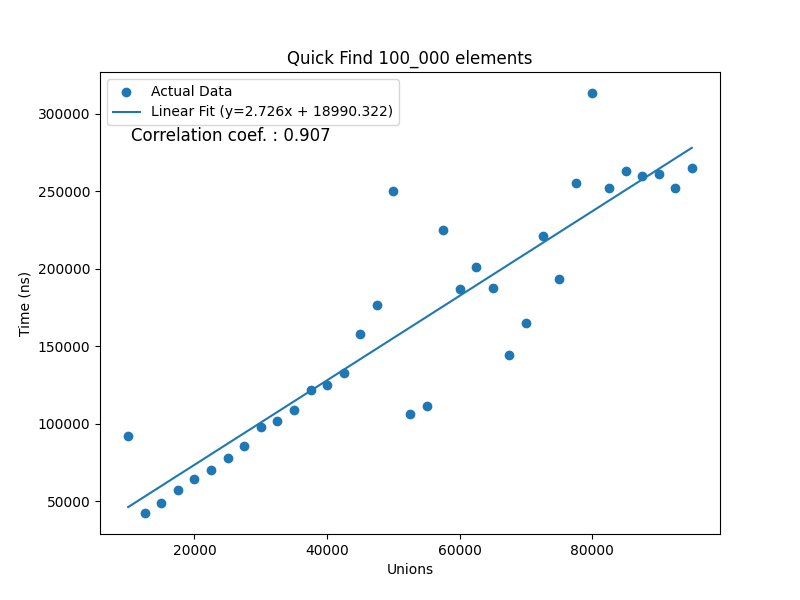
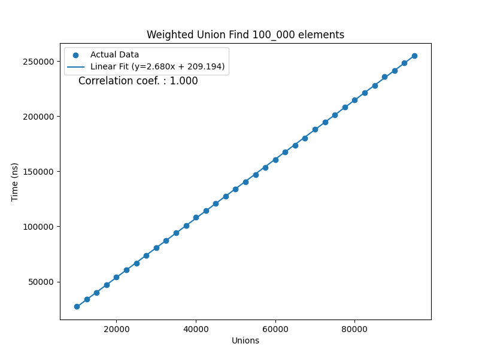
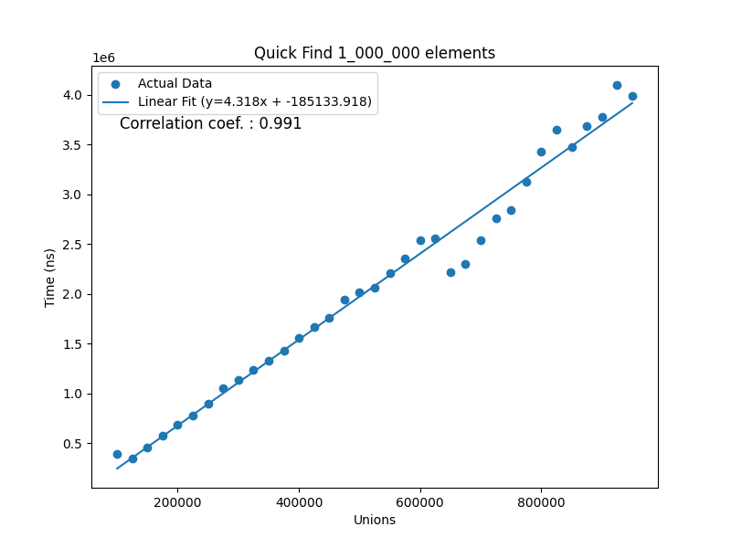
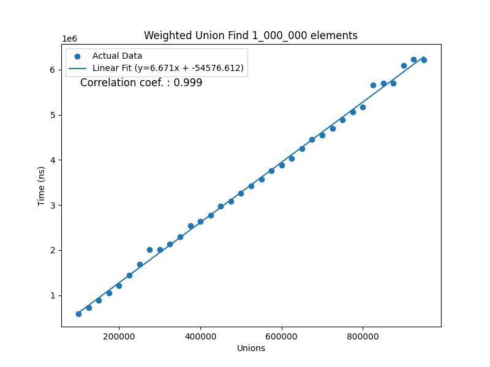
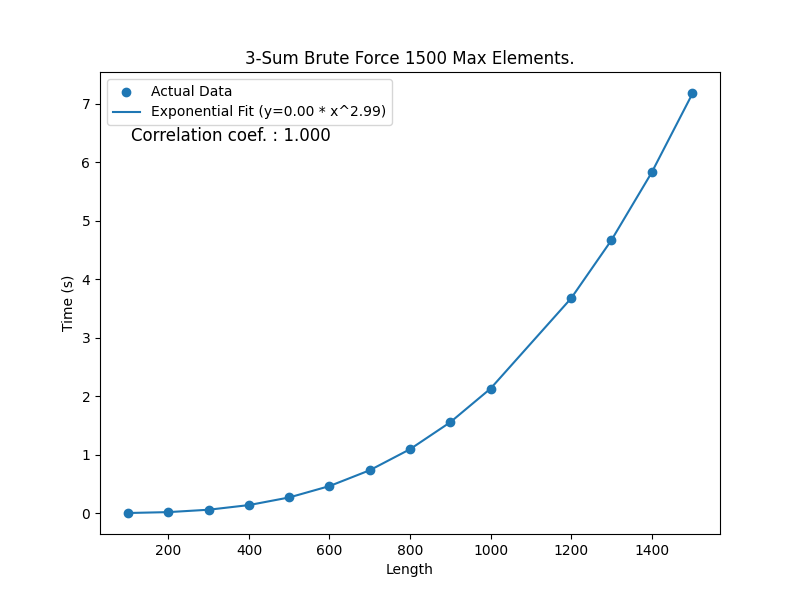

# Assignment 01

## Compilation and Running
### Java
In the top-most folder:

```shell
javac src/App.java
java src/App
```

### Python
The plotter script uses scipy, numpy and matplotlib. If you dont have these installed, you can do this via:
```shell
pip install -r requirements.txt
```
The plotter script can be run independently by passing args in the form:
```
python src/scripts/plotter.py Graph path.extension [x1, x2, ... xn] [y1, y2, ... yn] "X-Label" "Y-label" "Title" "Plot Type"
```

## Problem 4

For this problem, I implemented the Quick Find, and (height-based) Weighted Union Find, with no path compression.
To determine the growth of each, I split them into two groups, one for the data presented in the lecture slides, then one 
for larger trees (100,000 and 1,000,000 elements respectively).
- Firstly, I created the Timeit module, which acts similarly to python's timeit. It can dynamically take in a method from an Object with any number of arguments, and time its execution in nanoseconds, microseconds, etc.
- Then the Plotter, whicg calls the Python script to plot the graph of the runs.

At first I dynamically generated the number of unions, but I thought it'd be better for testing to just have a fixed, relatively small range for testing.

The way in which it works, is that for each union N, a random N-long array of X,Y pairs to be unioned is generated. The average time over a pre-determined number of samples is taken and saved to the time array.

```Java
private Double[] getQfTimesFixedSize(Integer[] unions, UnionFind uf) {
        int length = unions.length;
        Double[] times = new Double[length];
        
        for (int i = 0; i < length; i++) {
            uf.reset();
            Integer[][] pairs = Util.genXYPairs(unions[i], UF_SIZE);
            times[i] = measureUfExecTime(uf, pairs);
        }
        return times;
    }
```

When the execution time is recorded, outliers are also removed in sampleMean() via the IQR to remove random jitter from big processor state changes. These were prevalent whenever I used my computer for something else while testing at first. This is over 100 samples per X reading.
Once the times are recorded for each number of unions, the times are sent to the Plotter. i took inspiration from Matplotlib, where I have a Plotter object which can change state and be reused. The path, x and y labels, titles, and expected graph type can be specified on instantiation.

```Java

WeightedUnionFind wuf = new WeightedUnionFind(UF_SIZE);
Double[] times = getQfTimesFixedSize(unions, wuf);
System.out.println("\nGraphing WUF FS 100_00");
plt = new Plotter("uf/FS100_000_WeightedUnionFind.png", "Unions", "Time (10 ns)", Plotter.Type.LINEAR,"Weighted Union Find 100_000 elements");
plt.plot(unions, times);

```

Once created, you can call plot(), passing in two lists, the corresponding X and Y values. The does not only plot the grahs, but also performs linear regression to find the line of best fit on the data provided, as well as the linear correlation coefficient to deteermine how closely it fits the calculated line.

```Python
def linear_regression(x: list[float], y: list[float]) -> tuple[float, float, float]:
    slope, intercept, r_value, _, _ = linregress(x, y)
    return slope, intercept, r_value
```

Quick Find 100,000 Elements|Weighted Union Find 100,000 Elements
:-------------------------:|:-------------------------:
| 

Here we can see that for up to a tree of 95000 elements, the Quick Find is much faster growing function, with a greater slope, about 1.8 times that of the Weighted Union Find. The correlation coefficient for these is also very high for the subset of points chosen. Both are therefore linear functions, but the Weighted Union is much slower growing. This matches my expectations pretty closely with what i've seen from the lectures.

The larger arrays produce a strange but somewhat understandable result. At first glance, the graphs seem almost identical, but a look at the slope reveals that the Weighted Union Find still retains a lower slope, though somewhat hard to see.The equations for each set of readings differ mostly by the y-intercept, and have near perfect linear correlation.

Quick Find 1,000,000 Elements|Weighted Union Find ,1000,000 Elements
:-------------------------:|:-------------------------:
| .

While I expected the Weighted find to continue to dominate speed-wise, I supose this makes sense that with enough data, their positions should equalize somewhat, especially as the trees are not being flattened since I opted to not use path compression.

## Problem 7

In implementing the cached 3-sum, I first implemented a cached 2-sum:

```Java

public class TwoSum {
    public List<int[]> twoSum (Integer[] nums, Integer target, Integer start) {
        List<int[]> result = new ArrayList<>();
        Map<Integer, Integer> seen = new HashMap<>();
        for (int i = start; i < nums.length; i++) {
            int complement = target - nums[i];
            if (seen.containsKey(complement)) {
                int[] pair = {nums[seen.get(complement)], nums[i]};
                result.add(pair);
            }
            seen.put(nums[i], i);
        }
        return result;
    }
}

```

With this, my search for any two numbers will no longer be quadratic, but linear. Now, I implement this within the 3-sum, which will take 3-sum searching from a cubic task, to a quadratic one theoretically.

```Java

    public List<int[]> threeSum(Integer [] nums, Integer target) {
        List<int[]> result = new ArrayList<>();

        for (int i = 0; i < nums.length; i++) {
            int current = nums[i];
            List<int[]> twoSumRes = this.two.twoSum(nums, target-current, i+1);

            if(twoSumRes.isEmpty()) continue;

            for (int[] pair : twoSumRes) {
                int[] trip = {current, pair[0], pair[1]};
                result.add(trip);
            }
        }
        return result;
    }

```

Graphing these two out is largely the same as above, though now I specify that my data is theoretically "Exponential" in the Plotter. When the data is ingested by the script, it will now transform the data into Log2 equivalent, and perform linear regression on the log-log data.

```Python

def power_law(x: list[float], y: list[float]) -> tuple[float, float, float]:
    log_x = np.log2(x)
    log_y = np.log2(y)

    slope, intercept, coefficient = linear_regression(log_x, log_y)

    a = 2**intercept  # 2 raised to the power of intercept
    b = slope
    return b, a, coefficient

```

 From this, we get the same data as the linear set above, but we can use this to create a power law, and generate the expected data to compare to teh real data. This function is crude but effective for small data ranges:

```Python

def generate_expected_data(slope: float, intercept:float,x: list[float], plot_type:str):
    if plot_type == "Linear":
        return [(slope*x_val)+intercept for x_val in x]
    elif plot_type == "Exponential":
        return [intercept*(x_val**slope) for x_val in x]
    else:
        return None
        
```

Brute force 3-Sum 1500 Max | Cached 3-Sum 1500 Max
:-------------------------:|:-------------------------:
| .

A few things are immediately clear. The cached 3-sum variant takes much less time. Looking at the power law equations, we can see the slope of the brute-force variant is practically 3, and the cached variant has a slope of practically 2, meaning they are cubic and quadratic respectively.


# Test statment

python3 src/scripts/plotter.py graphs/uf/FS1_000_000_QuickFind.png [100000,125000,150000,175000] [578595.1,523364.3929,455945.3793,565627.0] 'Unions' 'Time(ns)' 'Quick Find_1_000_000 elements' Linear


python3 /src/scripts/plotter.py, graphs/uf/FS100_000_WeightedUnionFind.png, [10000,12500,15000,17500,20000,22500,25000,27500,30000,32500,35000,37500,40000,42500,45000,47500,50000,52500,55000,57500,60000,62500,65000,67500,70000,72500,75000,77500,80000,82500,85000,87500,90000,92500,95000] [143624.3478,174342.0,182967.087,57200.58333,71538.46154,70770.21429,79270.41667,87055.88462,97626.57143,105820.5714,110116.1304,120068.12,128116.08,148786.2692,274629.5333,154488.7407,343263.0,173517.76,177791.5,193440.4074,206483.0769,218260.9259,224430.6667,313657.931,241384.0417,256746.3077,255862.8462,283402.8621,299108.0,324205.25,343993.6786,340167.069,394024.4643,392675.6923,402881.28], Unions, Time (ns), Weighted Union Find 100_000 elements, Linear


python3 src/scripts/plotter.py graphs/uf/test.png [1,2,3,4,5] [2,4,6,8,10] TEST 'TEST Y' 'TEST SPACE' Linear